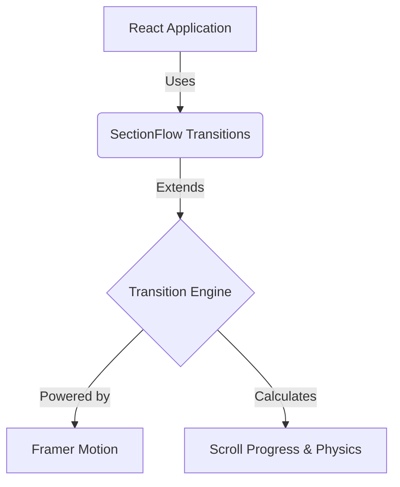

<div align="center">

<p align="center">
  <picture>
    <source media="(prefers-color-scheme: dark)" srcset="https://res.cloudinary.com/dub6akzeg/image/upload/v1783533138/sectionflow-dark_oitbfb.png">
    
  </picture>
</p>

**Cinematic, scroll-driven section transitions for modern web applications.**

[](https://npmjs.com/package/sectionflow)
[](https://github.com/your-org/sectionflow/blob/main/LICENSE)
[](https://npmjs.com/package/sectionflow)
[](https://www.typescriptlang.org/)
[](https://github.com/your-org/sectionflow)

SectionFlow provides a curated library of drop-in, highly optimized transition components built on **Framer Motion**. Create stunning, buttery-smooth scroll experiences in minutes without writing complex intersection observers or managing brittle timelines.

[**Documentation**](#) · [**Live Demo**](#) · [**Examples**](#) · [**npm**](https://npmjs.com/package/sectionflow) · [**GitHub**](https://github.com/your-org/sectionflow)

</div>

---


## 💡 Why SectionFlow?

Building complex, scroll-driven animations between website sections is traditionally painful.

**The Old Way:**
- ❌ Rigid layouts that break easily
- ❌ Complex, hard-to-maintain animation timelines
- ❌ Endless boilerplate code
- ❌ Poor scalability and jittery scroll performance
- ❌ Duplicate sections and messy state management

**The SectionFlow Way:**
- ✅ **Clean Composition:** Wrap your sections in `<SectionFlow>`, add a `<Section>`, and specify the outgoing transition.
- ✅ **Flawless performance:** Built entirely on Framer Motion's optimized rendering pipeline.
- ✅ **Zero boilerplate:** No intersection observers or event listeners to manage.
- ✅ **No Duplicate Renders:** Sections are rendered exactly once. The engine choreographs them seamlessly without cloning.

---

## ✨ What's New

We've completely overhauled SectionFlow to provide the best developer experience possible.

### 🆕 Open Source
SectionFlow is now completely open source! We believe in building together and welcome community contributions to make scroll-driven storytelling accessible to everyone.

### 🏗 Completely Redesigned Architecture
The internals have been rebuilt from the ground up. The new architecture emphasizes maintainability and predictability, ensuring your transitions work flawlessly as your application scales.

### 🔄 No More Duplicate Sections
Say goodbye to maintaining duplicated components just for animation states. Sections are now completely reusable and independent. Freely experiment with any combination of components without altering your core application logic.

### ⚡ Major Performance Improvements
We've obsessed over the details:
- Fewer re-renders
- Optimized rendering pipeline
- Smoother scrolling with spring physics
- Lightweight runtime
- Improved animation lifecycle management

### 🎬 Framer Motion First
SectionFlow is intentionally coupled with **Framer Motion**. By focusing on a single, industry-leading animation library, we ensure:
- Unmatched simplicity and consistency
- A dramatically smaller API surface
- Easier long-term maintenance
- The best possible developer experience

### 🚀 CLI for Any Framework
Bootstrap SectionFlow into your preferred React framework with a single command. The CLI automatically configures your environment and scaffolds the components you need.

```bash
npx sectionflow-cli init
npx sectionflow-cli add wave-reveal
```

### 📚 Cleaner Documentation
Our documentation has been entirely rewritten. It's now incredibly beginner-friendly while remaining a comprehensive resource for advanced use cases and custom transition authoring.

### 🧩 Extensible Architecture
Don't see the exact effect you need? SectionFlow's core engine makes it trivial to build, share, and publish your own custom transitions.

---

## 💎 Features

- 🎢 **Scroll-driven transitions:** Cinematic physics tied directly to user scroll.
- ♻️ **Reusable sections:** Clean component boundaries.
- 📘 **First-class TypeScript:** Excellent autocomplete and type safety.
- 🎭 **Powered by Framer Motion:** The gold standard for React animations.
- ⚡️ **Interactive CLI:** Scaffold components instantly.
- 🛠 **Custom transitions:** Build your own effects easily.
- 🚀 **Performance optimized:** Hardware accelerated and buttery smooth.
- 🌳 **Tree-shakeable:** Only ship the transitions you actually use.
- 📱 **Responsive by default:** Looks great on mobile and desktop.
- ♿️ **Accessible:** Respects `prefers-reduced-motion`.
- 🏭 **Production ready:** Battle-tested in the real world.
- 🌍 **Fully Open Source:** MIT Licensed.

---

## 📦 Installation

Install the core library using your favorite package manager:

```bash
npx sectionflow-cli init
# or
pnpm dlx sectionflow-cli init
# or
yarn dlx sectionflow-cli init
# or
bunx sectionflow-cli init
```

---

## 🛠 CLI Quick Start

The fastest way to get started is using the SectionFlow CLI. It automatically adds the necessary core components and your requested transitions directly into your codebase.

```bash
# Initialize SectionFlow in your project
npx sectionflow-cli init

# Add a specific transition
npx sectionflow-cli add cinematic-zoom
```

*The CLI generates the component files in your project so you have full control over the code.*

---

## ⚡ Quick Start

Wrap your existing sections in `<SectionFlow>` and define their outgoing transitions.

```tsx
import { SectionFlow, Section } from '@/components/sectionflow/core/section-flow';
import { CinematicZoom } from '@/components/sectionflow/transitions/cinematic-zoom';
import { WaveReveal } from '@/components/sectionflow/transitions/wave-reveal';
import { Hero, Features, Footer } from '@/components/sections';

export default function Page() {
  return (
    <SectionFlow>
      <Section transition={CinematicZoom}>
        <Hero />
      </Section>
      
      <Section transition={WaveReveal}>
        <Features />
      </Section>
      
      <Section>
        <Footer />
      </Section>
    </SectionFlow>
  );
}
```

---

## 🎨 Built-in Transitions

SectionFlow comes with dozens of beautifully crafted transitions out of the box.

| Transition | Preview |
| :--- | :--- |
| **Wave Reveal** |  |
| **Cinematic Zoom** |  |
| **Perspective Flip** |  |
| **Liquid Morph** |  |

*[View the full gallery in our documentation.](#)*

---

## 🏗 Project Architecture

SectionFlow uses a modular, layered architecture to keep things clean and performant.



- **React Application:** Your beautiful frontend code.
- **SectionFlow Transitions:** The drop-in components (e.g., `WaveReveal`, `CinematicZoom`).
- **Transition Engine:** The core hooks and context that manage scroll tracking, dead zones, and spring physics.
- **Framer Motion:** The underlying animation library handling the actual DOM updates efficiently.

---

## 📂 Folder Structure

When you initialize SectionFlow via the CLI, it creates a clean and predictable structure in your project:

```text
src/
└── components/
    └── sectionflow/
        ├── core/
        │   ├── section-flow.tsx      # The core engine and composition components
        │   ├── registry.ts           # Transition resolver
        │   └── types.ts              # Shared TypeScript definitions
        └── transitions/
            ├── wave-reveal.tsx       # Generated transition component
            └── cinematic-zoom.tsx    # Generated transition component
```

---

## 🏎 Performance Philosophy

Scroll animations can quickly ruin a website's feel if not handled correctly. SectionFlow is built with performance as a first principle:

- **Lazy Rendering:** Content is only animated when it enters the viewport.
- **Optimized Updates:** We bypass React state for scroll values, using Framer Motion's `useScroll` and `useSpring` to update the DOM directly.
- **Hardware Acceleration:** All transforms and opacity changes are GPU-accelerated.
- **Smooth Scrolling:** Built-in spring physics ensure transitions feel buttery smooth, regardless of how fast the user scrolls.

---

## 🌟 Examples

See how SectionFlow is being used in the wild:

- **[Creative Portfolio](#)** - Showcasing work with cinematic flair.
- **[SaaS Landing Page](#)** - Engaging product features with scroll-tied reveals.
- **[Digital Agency Website](#)** - High-impact, memorable storytelling.
- **[Editorial Experience](#)** - Immersive, long-form articles.
- **[Documentation Site](#)** - Subtle, helpful transitions between dense information blocks.

---

## 📚 Documentation

For complete API references, advanced usage guides, and instructions on creating your own custom transitions, please visit the **[official documentation](#)**.

---

## 🤝 Contributing

We love our community! Whether it's adding a new stunning transition, fixing a bug, or improving the docs, your help is welcome.

1. **Fork** the repository.
2. **Clone** your fork locally.
3. **Install** dependencies: `pnpm install`
4. **Run** the development server: `pnpm dev`
5. **Submit** a Pull Request!

*Have a cool custom transition? Submit it! We are always looking to expand the built-in library.*

---

## 🗺 Roadmap

- [x] Initial open-source release
- [x] Rebuilt core architecture
- [x] CLI generation tool
- [ ] Add 20+ new built-in transitions
- [ ] Next.js App Router specific optimizations
- [ ] Native WebGL transition support
- [ ] Vue / Svelte support (Exploratory)

---

## 💬 Community

Join the conversation and show off what you've built!

- [**GitHub Discussions**](#) - Ask questions and share ideas.
- [**Issues**](#) - Report bugs or request features.
- [**Discord**](#) - Chat with the maintainers and community.
- [**X / Twitter**](#) - Follow us for updates.

---

## 📄 License

Distributed under the [MIT License](https://github.com/your-org/sectionflow/blob/main/LICENSE).

---

## 🙏 Acknowledgements

A massive thank you to the open-source community, the creators of [Framer Motion](https://www.framer.com/motion/), and everyone who has submitted an issue, PR, or piece of feedback to make SectionFlow better.
